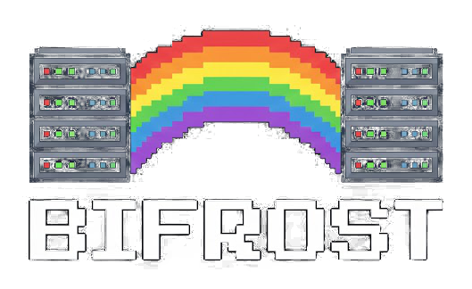

<p align="center">
    
</p>

<h1 align="center">Bifrost</h1>

<p align="center">
  <strong>SSH/SFTP Connection Manager</strong><br>
  <em>A modern terminal UI client for managing your SSH and SFTP connections</em>
</p>

<p align="center">
  
  
  
</p>

---

## Features

- **Connection Management** - Store and organize multiple SSH/SFTP connections
- **SFTP Browser** - Navigate remote filesystems 
- **File Operations** - Create, rename, delete, download, and edit remote files
- **Inline Editor** - Edit remote files directly with your preferred editor
- **Secure Storage** - Encrypted password storage for your connections
- **Modern TUI** - Beautiful terminal interface built with Bubble Tea

## Installation

### From Source

```bash
# Clone the repository
git clone https://github.com/steevenmentech/bifrost.git
cd bifrost

# Build
go build -o bifrost ./cmd/bifrost

# Run
./bifrost
```

### Requirements

- Go 1.21 or higher
- A terminal with Unicode support (recommended: iTerm2, Alacritty, Kitty, Ghostty)
- Nerd Font for icons (optional but recommended)

## Usage

```bash
# Start Bifrost
./bifrost
```

## Keyboard Shortcuts

### Main Menu

| Key | Action |
|-----|--------|
| `↑` / `↓` | Navigate up/down |
| `Enter` / `l` | Select/Connect |
| `n` | New connection |
| `e` | Edit connection |
| `d` | Delete connection |
| `q` | Quit |

### SFTP Browser

| Key | Action |
|-----|--------|
| `↑` / `↓` | Navigate up/down |
| `ctrl+u` / `ctrl+d` | Page up/down |
| `G` | Go to bottom |
| `h` | Parent directory |
| `l` / `Enter` | Open directory |
| `g` / `Tab` | Go to path |
| `~` | Go to home |
| `.` | Toggle hidden files |
| `n` | Create new file |
| `N` | Create new directory |
| `d` | Delete file/directory |
| `r` | Rename |
| `e` | Edit file |
| `D` | Download to ~/Downloads |
| `y` | Copy path to clipboard |
| `q` | Quit |

### Connection Form

| Key | Action |
|-----|--------|
| `Tab` / `Shift+Tab` | Next/Previous field |
| `Enter` | Save connection |
| `Esc` | Cancel |

## Configuration

| Platform | Path |
|----------|------|
| **macOS** | `~/Library/Application Support/bifrost/config.yaml` |
| **Linux** | `~/.config/bifrost/config.yaml` | 

## Project Structure

```
bifrost/
├── cmd/
│   └── bifrost/          # Main application entry point
├── internal/
│   ├── config/           # Configuration management
│   ├── sftp/             # SFTP client implementation
│   ├── ssh/              # SSH client implementation
│   └── tui/              # Terminal UI components
│       ├── keys/         # Keybinding definitions
│       ├── styles/       # UI styles and themes
│       └── views/        # UI views and components
├── pkg/                  # Public packages
└── assets/               # Logo and images
```

## Tech Stack

- **[Bubble Tea](https://github.com/charmbracelet/bubbletea)** - TUI framework
- **[Lip Gloss](https://github.com/charmbracelet/lipgloss)** - Style definitions
- **[Bubbles](https://github.com/charmbracelet/bubbles)** - TUI components
- **[pkg/sftp](https://github.com/pkg/sftp)** - SFTP client library
- **[golang.org/x/crypto/ssh](https://pkg.go.dev/golang.org/x/crypto/ssh)** - SSH client library

## License

Non-Commercial License - Free to use, modify, and contribute. Commercial use prohibited. See [LICENSE](LICENSE) for details.

---

<p align="center">
  Made with  by <a href="https://github.com/steevenmentech">@steevenmentech</a>
</p>